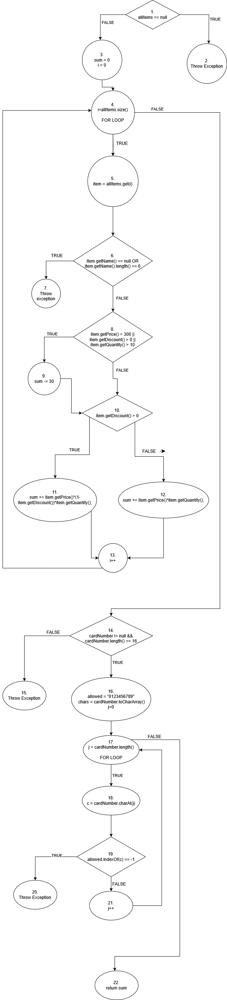

# Втора лабораториска вежба по Софтверско инженерство

# Давид Поповски бр. на индекс 235020

# Control flow graph

# Цикломатска комплексност
N = 22	E = 25 P = 1
25-22+2 = 5
По броење на Nodes и Edges и користење на формулата, стигнав до цикломатска комплексност = 5

# Тест случаи според критериумот Every statement
### 1- Сите валидни вредности со попуст:
allitems != null, item.getName() != null, item.getPrice>300, item.getDiscount() > 0,cardNumber != null && cardNumber.length() == 16,allowed.indexOf(c) != -1 --> Nodes: 1,3,4,5,6,8,9,10,11,13,4,14,16,17,18,19,21,17,22

### 2- Allitems има вредност null:
allitems == null --> Nodes: 1,2

### 3- Item од allitems има null вредност за име:
allitems != null, item.getName() == null --> Nodes: 1,3,4,5,6,7

### 4- cardNumber има вредност null

	allitems != null, item.getName() == null, item.getDiscount>0,cardNumber==null --> Nodes:1,3,4,5,6,8,9,10,11,13,4,14,15

### 5- cardNumber содржи карактер различен од број:
allitems != null, item.getName() != null, item.getPrice>300, item.getDiscount() > 0,cardNumber != null && cardNumber.length() == 16,allowed.indexOf(c) == -1 --> Nodes: 1,3,4,5,6,8,9,10,11,13,4,14,16,17,18,19,20

### 6- Сите валидни вредности без попуст:
allitems != null, item.getName() != null, item.getPrice>300, item.getDiscount() < 0,cardNumber != null && cardNumber.length() == 16,allowed.indexOf(c) != -1 --> Nodes: 1,3,4,5,6,8,9,10,12,13,4,14,16,17,18,19,21,17,22

# Тест случаи според критериумот Every path
 - 1-item.getName==null T,X
- 2-item.getName!=null,item.getName.length==0 F,T
- 3-item.getName!=null,item.getName.length!=0 F,F

- 4-item.getPrice>300, T X X
- 5-item.getPrice<300, item.getDiscount()>0 F,T,X
- 6-item.getPrice<300, item.getDiscount()<0, item.getQuantity>10 F,F,T
- 7-item.getPrice<300, item.getDiscount()<0, item.getQuantity<10 F,F,F

# Објаснување на напишаните unit tests
- multipleConditionsNullName -> проверувам дали фрла Exception поради празно име
- everyStatementCardNumberPovekjeOd16 -> проверувам дали фрла Exception ако се искористи број на картичка подолг од 16 цифри